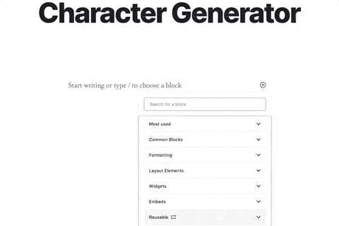
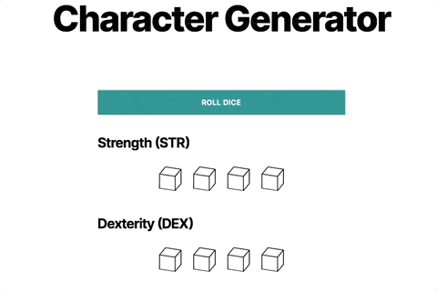

# Character Generator #

## Description ##

This plugin extends the RAVE Dice Roller block to create a simple character generator to determine ability scores.

## Installation ##

1. Ensure the [`dice-roller` block plugin](https://github.com/ravewebdev/dice-roller) is installed and activated.
2. Upload the `character-generator` folder to the `/wp-content/plugins` directory.
3. Activate the Character Generator plugin through the 'Plugins' menu in WordPress.
4. Import the Character Generator reusable block by uploading `assets/character-generator.json` in the Blocks CPT admin area.
5. Add the 'Character Generator' block in a post or page.
6. Save and view your page or post.
7. Click 'Roll Dice' to generate die results for all ability scores.

## Frequently Asked Questions ##

### How should I use this block? ###
Use this block to quickly generate ability scores for a new TTRPG character, following the standard method of rolling 4 d6 dice, dropping the lowest roll, and taking the total of the remaining rolls.

### How can I report issues or suggest improvements? ###
Feel free to create an issue or PR in the [Github repo here](https://github.com/ravewebdev/character-generator).

## Screenshots ##

### Admin Demo: Insert Character Generator block ###

### Frontend Demo: Roll dice ###

## Changelog ##

### 1.0.0 ###
* Added: Included the basic JSON for the Character Generator reusable block.
* Added: Added functionality to hide individual Dice Roller buttons in a Character Generator block.
* Added: Created new button to roll all dice in a Character Generator block at once.
